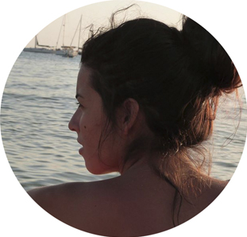

## Sobre mí

Soy una estudiante de cuarto curso de Lenguas Aplicadas de la Universidad Pompeu Fabra. Vivo en el Raval. Me gusta leer, escuchar música y beber vino (si es todo a la vez, mejor). Soy mujer, feminista, de izquierdas, anticapitalista, republicana, antifascista y, encima, catalana. También hago otras cosas buenas como ser madre de un gato y reciclar. 

